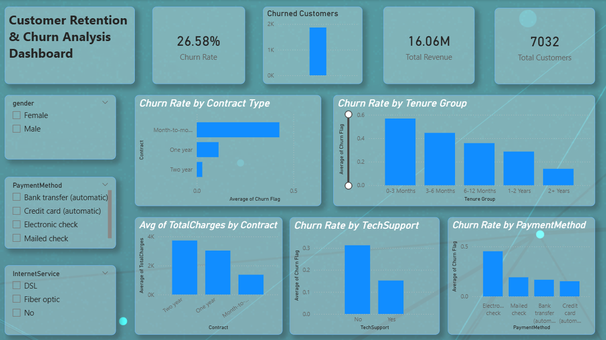

# FUTURE_DS_02
#  Customer Retention & Churn Analysis  
## Data Science Internship – Task 2  

---

##  Objective  
Analyze customer data to identify churn patterns, key retention drivers, and customer lifetime trends for a subscription-based business. The goal is to provide actionable recommendations to reduce customer loss and improve retention.

---

##  Tools Used  
- Power BI    
- DAX  

---

##  Dataset  
Customer Churn Dataset containing customer demographics, subscription details, payment methods, service usage, tenure, and churn status.

---

##  Key Insights  

1. The overall churn rate is **26.58%**, indicating that approximately 1 in 4 customers leave the service.  
2. Customers on **month-to-month contracts** show the highest churn rate compared to one-year and two-year contracts.  
3. Majority of churn occurs within the **first 3 months of tenure**, highlighting early-stage customer dissatisfaction.  
4. Customers without **Tech Support services** have significantly higher churn rates.  
5. Customers using **Electronic Check payment method** show higher churn compared to automatic payment methods.  
6. Long-tenure customers (2+ years) demonstrate strong loyalty and lower churn rates.  
7. Two-year contract customers contribute stable revenue with minimal churn risk.  

---

##  Business Recommendations  

1. Promote long-term contracts through discounts and bundled offers.  
2. Strengthen onboarding and engagement within the first 90 days.  
3. Encourage adoption of Tech Support services to improve customer satisfaction.  
4. Incentivize customers to switch to automatic payment methods.  
5. Implement loyalty programs for customers completing one year of service.  
6. Proactively target high-risk customer segments with retention campaigns.  

---

##  Dashboard Features  

- KPI Summary (Total Customers, Churned Customers, Churn Rate, Total Revenue)  
- Churn Rate by Contract Type  
- Churn Rate by Tenure Group  
- Churn Rate by Payment Method  
- Impact of Tech Support on Churn  
- Revenue Distribution by Contract  
- Interactive Filters  

---

##  Repository Structure  

- Dashboard (.pbix file)  
- Dataset  
- Insights Report (PDF)  
- README.md  

---

## Dashboard Preview  

